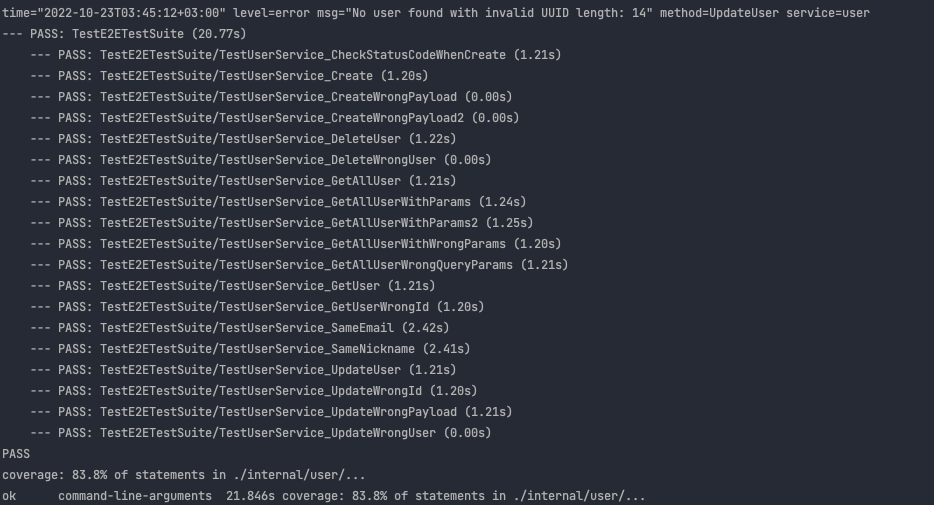

# faceit-technical-test

[](https://github.com/cemayan/faceit-technical-test/actions/workflows/push.yml)

### Introduction

The project consists of three microservices
- User
- User(gRPC)
- gRPC Event Server

> gRPCEventServer processes incoming requests as streams


You can use this API in 3 ways:

- HTTP
- HTTP with gRPC
- gRPC
- ---

- If you want to use HTTP you should use **user**  microservice.
- If you want to use HTTP with gRPC you should use **user_grpc**  microservice.
- If you want to use  gRPC you should use **gRPCEventServer** microservice.


> You can use user,user_grpc api with auth on this branch https://github.com/cemayan/faceit-technical-test/tree/auth

##### Evans
> You can use **[evans](https://github.com/ktr0731/evans)** to test gRPC server

You can find under the  **protos** folder of project


--- 

### Usage

You can start it in docker environment

```shell
 docker-compose -f deployment/docker-compose.yml  up
```
---

### Docs

You can reach to user swagger doc on this link
[http://localhost:8089/api/v1/swagger](http://localhost:8089/api/v1/swagger)

You can reach to user_grpc swagger doc on this link
[http://localhost:8092/api/v1/swagger](http://localhost:8092/api/v1/swagger)

### Testing

You can check the test coverage

```shell
ENV="test" go test -v -cover ./... -coverpkg=./internal/user/... -coverprofile=coverage.out 
go tool cover -html=coverage.out     
```

---

### Example Requests

You can get user which is  filtered, sorted and paginated list.

http://localhost:8089/api/v1/user/?limit=10&page=1&cQuery=country%20%3D%20%3F&cValue=UK

http://localhost:8089/api/v1/user/?limit=10&page=1&sColumn=0&sType=0
